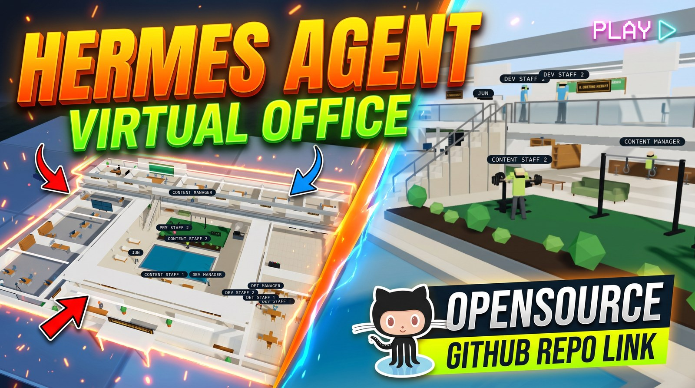

# 🏢 Hermes Virtual Office

<div align="center">

**An Open-Source 3D Virtual Workspace & Meeting Simulator for Autonomous AI Agents**

[](LICENSE)
[](https://nextjs.org/)
[](https://threejs.org/)
[](https://www.typescriptlang.org/)
[](https://github.com/NousResearch/Hermes-Agent)

[Features](#-key-features) • [Quick Start](#-quick-start) • [Architecture](#-architecture) • [Documentation](#-documentation) • [Contributing](#-contributing)

</div>

[](https://youtu.be/ezEthYDU_bw)

---

## 🌟 Overview

**Hermes Virtual Office** transforms your autonomous AI agents into an interactive, living 3D office. Instead of staring at dry terminal logs or static dashboard rows, watch your fleet work in real-time:

- 💻 **Every division has its own desks.** An agent with work at its desk *stops wandering* and goes to sit down.
- 🗣️ **Agents hold round-table meetings** in one of five named rooms, chosen by the participants' divisions.
- 🤝 **Agents talk to each other directly** over the A2A protocol — the caller's avatar walks over to the callee's desk, and the transcript is readable in the office.
- 🔍 **QA reviewers walk across the office** to inspect work at the owner's desk.
- ☕ **Idle agents relax** — pool, daybeds, gym, BBQ courtyard, lounge sofas, darts. An idle avatar never calls a model.
- 📋 **Integrated Kanban board**, 100% synchronized with Hermes tasks, plus approvals, evidence and independent verification.
- 📱 **Fullscreen panels on any screen size**, desktop or phone.

Built with **Next.js**, **Three.js**, and **TypeScript**. It reads and drives your
installation through the official `hermes` CLI — with one read-only exception, stated plainly
below — so it works against any local Hermes install without a bespoke API layer.

---

## 🔗 Made by

This office is not a demo — it runs the daily operations of my own businesses,
on the same Hermes install it drives:

- 🌐 **Portfolio** · [syahrur.com](https://syahrur.com)
- 💳 **QRIS Payment Gateway** · [hollapay.id](https://hollapay.id)
- 🏢 **Hollateknologi** — the software house behind it · [hollateknologi.id](https://hollateknologi.id)
- 🎬 **Dracin Sub Indo** · [dracinsubindo.com](https://dracinsubindo.com)
- 🖥️ **PC Build It** — custom PC builds · [pcbuildit.com](https://pcbuildit.com)
- 🗄️ **Radiusku** — VPS & server hosting · [radiusku.com](https://radiusku.com)

---

## ✨ Key Features

### 1. Interactive 3D Low-Poly Office

- **Three floors of real geometry**: ground-floor lobby, courtyard and one work room per division; an upper level carrying the CEO suite and five named meeting rooms; a walkable external stair linking them.
- **Three desks per division** — one manager, two staff — each with a monitor, status light and role badge.
- **The CEO suite** admits only a CEO or a division manager; everyone else is refused by the navigation grid, not by a visual trick.
- **Courtyard with four coherent zones**: gym (north), planting, daybeds (west), seats (south) and BBQ (east). The pool is swimmable; the daybeds are for lying on.
- **A duty state machine decides where a body belongs**, in this strict order:

  | Priority | Duty | Meaning |
  |---|---|---|
  | 1 | `meeting` | Participating in a live meeting |
  | 2 | `a2a` | In an agent-to-agent conversation — **stops desk work** |
  | 3 | `desk` | Has a task, a live chat, or a cron run at its desk |
  | 4 | `review` | Walking over to inspect someone else's work |
  | 5 | `idle` | Genuinely free — may relax |

  The order is the point: an agent that has work is never allowed to keep lounging. `review` and `idle` also never *preempt* real work; they only apply to a body that is otherwise free.
- **Idle avatars never call a model.** There is no chat bridge in the render path — verified by a self-test, because "cheap ambience" that silently burns tokens is not cheap.

### 2. Agent-to-Agent (A2A)

- **Discovery**: every served agent answers an A2A agent card, so callers can see what it is and what it can do before talking to it.
- **Direct calls between agents**, with conversation history that survives the office app restarting.
- **The transcript panel reads Hermes' own session store** — only sessions whose source is genuinely A2A. A human's chat that happens to mention a call is deliberately *not* read, so the two are never confused.
- **The caller's avatar walks to the callee's desk** while the conversation is live. If the peer has no desk, the trip is cancelled rather than sent to a place that does not exist.
- **Honest discovery**: asking "who owns this domain?" returns `null` when nobody owns it. The office displays that as-is and never invents an owner.
- **Loopback only.** The A2A server binds `127.0.0.1`; it is not reachable from the network.
- **Spawning registers A2A automatically.** Creating an agent from the office (avatar slot / spawn panel) writes the served entry (`local: false`) plus the `a2a_agents` peer entries through the same writers the CLI path uses (`ensureA2aPeer`, called from `POST /api/hermes/agents` in `src/app/api/hermes/agents/route.ts`). Each row carries an **A2A Ready** checklist with three honest states — ✅ ready (registered *and* the gateway restarted after it), 🟡 registered but not yet active, ❌ not registered (`src/components/AgentSpawnPanel.tsx`).
- **A restart notice, not a silent green light.** After a successful registration the UI pops "please restart the server" (`src/components/RestartNotice.tsx`) with a restart button that schedules it via `POST /api/hermes/gateway-restart` — or shows a copyable manual command when scheduling fails. Why restart is needed: the served list is read once at gateway boot, with no hot reload (`docs/DEPLOYMENT.md` §7.7 item 3).
- **`kill` deletes cleanly.** `action: "kill"` deletes the profile and purges its tasks, then removes the served entry, the `a2a_agents` peers (global scope plus other served profiles), the `agent:<name>` avatar row, and any leftover `profiles/<name>/` directory (the `kill` branch in `src/app/api/hermes/agents/route.ts`). Cleanup failures are reported, not hidden — and served/peer removal only takes effect after a gateway restart.

### 3. Multi-Agent AI Meeting Room

- Trigger collaborative discussions between 2 to 4 agents on any topic.
- **Two honest modes.** `simulasi` — the gateway LLM speaks, **not** the agents (the old behaviour, labelled as such). `a2a` — real agents take turns over the A2A protocol (`MeetingMode` in `src/lib/hermes/meeting-a2a.ts`, mode radio in `src/components/MeetingPanel.tsx`). Pick participants in the meeting panel; each participant **must be served** or the meeting is refused, naming who is not served (`assertA2aParticipants` in `src/lib/hermes/meeting-a2a.ts`). Mode `a2a` needs no `AI_BASE_URL`/`AI_API_KEY`; mode `simulasi` does.
- **Transcripts outlive the app.** Every meeting is archived to `data/meetings/` (see `DATA_DIR` in `src/lib/hermes/meeting.ts`), with its mode stamped on the archive. Mode-`a2a` archives also list the `ctx-*` session ids, so each turn can be verified verbatim against `hermes sessions export`. A live meeting can be cancelled from the panel — the archive is then marked **DIBATALKAN** (cancelled) instead of finished, noting at which turn it stopped (`POST /api/hermes/meeting/cancel`).
- **Still limited, stated plainly.** A turn that a peer fails to answer is recorded as a `GAGAL` turn, never invented by the LLM (`src/lib/hermes/meeting-a2a.ts`). The reverse direction of a call depends on the callee actually owning the `a2a` toolset — see the doctor check below.
- **Room routing by division** — a single division meets in its own room, an exec-heavy meeting takes another, and a cross-division meeting takes the ten-seat room. Rooms are not random.
- **Speech bubbles & gestures**: CSS2D balloons synchronized with the active speaker.
- **Auto-generated minutes** containing **Decisions**, **Action Items** and **Identified Risks**, with a parser stable enough to survive a heading rewrite.

### 4. Live Screen Peeking & Interventions

- Click any working agent's monitor to open a **live terminal modal** with the real commands, tool calls and progress.
- Send a course correction, or cancel a stalled loop, straight from the office.

### 5. Direct Chat with Memory, and a Model Picker

Talk to any agent from the office with real memory: each agent has one thread, stored in
Hermes' own session store, so the conversation survives a restart of this app.
`hermes chat -q` answers and returns a session id; `--resume` continues it.

An agent and a profile are the same thing: chatting with a profile runs that profile and
stores the thread in its memory. The **Agent** panel creates a profile the same way the CLI does:

```bash
hermes profile create <name> --no-skills
```

**Picking a model also copies the provider definition.** The model picker lists real providers from `hermes config get custom_providers --json` (`listCustomProviders` / `providersToModels` in `src/lib/hermes/kanban.ts`), and choosing a model writes both the model and its provider into the profile (`setProfileModel` in `src/lib/hermes/kanban.ts`, called from `POST /api/hermes/agents`). Without that copy the agent dies with `Unknown provider` even though a default model is set — the doctor's `model-providers` check watches for exactly this (`src/lib/hermes/doctor.ts`).

Each agent's **Description** becomes the text other agents see when they discover it, and
**Keahlian / domain** is a domain map used by the office to work out who owns what. That map
is deliberately *office-only* — it is not advertised over A2A, because what an agent can really
do is decided by its toolsets, not by a label.

The install's own `default` profile is hidden from the office and cannot be spawned back —
it is the profile the app itself runs under.

### 6. Command Control, Not Just a Pretty Dashboard

The office is meant to be where you *run* the fleet, so the controls refuse to lie to you:

- **A real approval queue.** What is waiting on a human decision is a queue, and a waiting
  approval stops the agent — it does not quietly keep going.
- **Evidence, not a checkmark.** A finished task's diff and artifacts can be inspected from
  the office. There are several real sources for that evidence, and "done ✓" alone is not one of them.
- **Claim ≠ verified.** Independent verification is a first-class state: a worker's own
  summary is not proof, and the reviewer's verdict is recorded as a trail that can be reopened
  when changes are requested.
- **Per-agent limits**, and **every refusal is audited.** A staff agent attempting a
  privileged action is refused *and* the refusal is written down.

### 7. "Siap pakai?" health checks & self-repair (API — tanpa UI)

The office refuses to show a green light it cannot prove. The **Siap pakai?**
engine (read-only `GET /api/hermes/doctor` → `runDoctor` in
`src/lib/hermes/doctor.ts`) runs a dozen checks; every check returns `pass`,
`fail`, or `unknown` ("tidak bisa dipastikan" — reported, never forced green).
There is currently **no UI** for it: the topbar carries no `A2A` / `Siap pakai?`
button and `src/components/DoctorPanel.tsx` + `src/components/A2aPanel.tsx`
were deleted (UI-CLEAN-1). Call the API directly with curl (port 3300 is the
systemd unit; `npm run dev` serves 3001, `npm start` serves 3000):

```bash
curl -s http://127.0.0.1:3300/api/hermes/doctor | python3 -m json.tool
curl -s http://127.0.0.1:3300/api/hermes/selfrepair | python3 -m json.tool  # pratinjau
curl -s -X POST http://127.0.0.1:3300/api/hermes/selfrepair \
  -H 'Content-Type: application/json' -d '{}' | python3 -m json.tool       # jalankan
curl -s http://127.0.0.1:3300/api/hermes/a2a/transcript | python3 -m json.tool  # riwayat A2A
```

Per-agent A2A state (served/unlisted, the three-state "A2A Ready" checklist,
the post-serve restart notice) lives in the **Agent panel**
(`src/components/AgentSpawnPanel.tsx`, opened from the topbar **Agent** button
or by clicking an avatar) — that enabler is untouched by UI-CLEAN-1.

| Check (`id`) | pass means | fail means | unknown means |
|---|---|---|---|
| Hermes CLI ketemu & bisa dipanggil (`cli`) | binary runs | binary missing/broken | — |
| Board bisa dibaca (`board`) | kanban readable via CLI | board unreadable | — |
| Profil agent ada (`profiles`) | ≥ 1 profile | none | profile list unreadable |
| Profil punya model (`models`) | every profile has a default model | some profile has none | unreadable |
| Provider model bisa diresolusi (`model-providers`) | each profile's `custom:<name>` provider has a matching definition (copied by the model picker) | dangling provider — chat to it dies with `Unknown provider` | provider definitions unreadable |
| Provider LLM rapat simulasi (`simulasi`) | `AI_BASE_URL` + `AI_API_KEY` set | not configured — `simulasi` meetings refuse with "not configured" | — |
| Platform A2A nyala (`a2a-platform`) | `platforms.a2a` enabled with a port (no token → loopback only) | disabled / no port | config unreadable |
| Agen yang di-serve (`served`) | fresh entries, all `local: false` | stale entries (profile gone), `local: true` (wrong identity), or nothing served | served list unreadable |
| Butuh restart gateway? (`restart`) | gateway started after `config.yaml` changed — stored served entries are live | config newer than gateway start — entries stored but NOT yet active | gateway start time unreadable |
| Origin boleh menulis (`origin`) | request origin allowed to write | blocked origin attempting a write | — |
| Agent bisa memanggil, toolset a2a (`caller`) | every served agent owns the `a2a` toolset (can be called *and* can call) | some served agent is mute: callable but cannot call anyone (one-way meetings) | toolset list unreadable, or nothing served to judge |
| Nama agent bisa diresolusi, peer a2a_agents (`peers`) | each served agent has a resolvable `<name>-local` peer | missing peer — `a2a_call("name")` fails with `unknown agent` | peer list unreadable |
| A2A menolak path tak dikenal (`fallthrough`) | POST to an unknown path is rejected (`no agent is served at`), GET is 404 | unknown paths fall through to the default agent — misleading | A2A port unreachable |

**Self-repair: preview first, then run, then doctor-after** (same API, no UI).
`GET /api/hermes/selfrepair` previews (`previewRepairs` in
`src/lib/hermes/selfrepair.ts`) and, only after the operator approves, `POST` runs the repairs (`runRepairs`) and re-runs the doctor so the
new state is shown — not claimed. It sweeps seven kinds of rot, idempotently
(healthy state → nothing changes): stale served entries, avatar bodies without
a profile, duplicate avatar rows, leftover profile directories, dangling
providers, missing `a2a` toolsets, missing `a2a_agents` peers. What it *cannot*
fix is returned as `unfixable` with the reason ("tidak bisa dipastikan …"),
never forced.

**Hermes-side contract.** Some checks only pass because Hermes itself behaves a
certain way — the served list read once at boot, `local: false` required, the
unknown-path rejection. Those behaviours live in Hermes, not here; the
re-installable patch and the five-item contract are documented at
[docs/patches/hermes-a2a-unknown-path-404.README.md](docs/patches/hermes-a2a-unknown-path-404.README.md)
and [docs/DEPLOYMENT.md](docs/DEPLOYMENT.md) §7.7 "Kontrak Hermes yang
dibutuhkan". Read those two before blaming the office for a red check.

**Check it yourself** (proof, not promises — 3300 is the systemd unit;
`npm run dev` serves 3001, `npm start` serves 3000):

```bash
curl -s http://127.0.0.1:3300/api/hermes/doctor | python3 -m json.tool
curl -s http://127.0.0.1:3300/api/hermes/selfrepair | python3 -m json.tool
curl -s http://127.0.0.1:3300/api/hermes/a2a/transcript | python3 -m json.tool
# unknown A2A path must be REJECTED, not answered (needs docs/patches/ applied):
curl -s -X POST http://127.0.0.1:9900/zz-tidak-ada \
  -H 'Content-Type: application/json' \
  -d '{"jsonrpc":"2.0","id":"cek","method":"message/send","params":{"message":{"role":"user","parts":[{"text":"ping"}]}}}'
# a meeting turn, verbatim against the session store (<ctx-id> from the archive):
hermes sessions export --format jsonl --source a2a | grep <ctx-id>
# toolsets an agent card may advertise (the real list, not a label):
hermes tools list --platform cli
# providers the model picker copies from:
hermes config get custom_providers --json
```

### 8. Three View Modes, Fullscreen Panels, Mobile-Friendly

- **3D** isometric mode, an accessible **Kanban** board, and a low-cost **Sprite** mode for
  machines that should not render a full scene.
- Every top-bar control — **+ Tugas, Ruang rapat, Agent, Cron, Papan, Sistem, Chat** —
  opens a **fullscreen panel**, so a small screen gets the whole panel instead of a cramped drawer.
  (UI-CLEAN-1 removed the **A2A** transcript viewer and the **Siap pakai?** health panel;
  their APIs — `/api/hermes/a2a/transcript`, `/api/hermes/doctor`,
  `/api/hermes/selfrepair` — stay, UI-less. Per-agent A2A serve/unserve lives in the
  **Agent** panel.)
- The 3D / Kanban / Sprite switch is intentionally kept **outside** the scrolling button row,
  so the view choice never slides off a phone screen.
- Mobile viewport is handled honestly: `viewportFit: cover` plus safe-area insets, because
  without it a notched phone reports `env(safe-area-inset-*)` as `0` and the chat input ends up
  under the keyboard.

### 9. Talks to the Hermes CLI, not a private schema

- Drives the board through `hermes kanban ... --json`, and A2A history through
  `hermes sessions export --format jsonl --source a2a`, the CLI's documented surface, rather
  than reading `kanban.db` directly. Board layout and storage format can change without
  breaking this app.
- **One stated exception, because calling this "no database access" would be a lie:**
  the observability panel reads Hermes' `state.db` **read-only** (`node:sqlite`) for
  per-session token, cost and model figures, which the CLI has no surface for. Nothing
  ever *writes* to a Hermes database.
- **The office keeps its own store, separately** — office-only state (the office name, where
  each avatar was last standing, which division slots are still dummies) lives in the
  office's own SQLite file, not in Hermes' data.
- No vendored copy of Hermes internals.
- Ships a mock LLM provider (`scripts/mock-provider.py`) for testing meetings without
  spending tokens. It deliberately reproduces a *misbehaving* gateway's response shape, so
  tests fail loudly instead of passing on a well-behaved mock.

---

## 🚀 Quick Start

### Prerequisites
- Node.js 18.17+ or 20+
- A local Hermes install (the board is driven through its CLI)
- npm, pnpm, or bun

### 1. Clone the repository
```bash
git clone <this-repo-url>
cd hermes-virtual-office
```

### 2. Configure Environment
```bash
cp .env.example .env.local
```

Edit `.env.local` to configure your Hermes instance:
```env
# REQUIRED: path to the hermes executable (the board is driven through its CLI)
HERMES_BIN=/usr/local/bin/hermes

# Optional: pin a board, or set a CLI timeout
# HERMES_KANBAN_BOARD=default
# KANBAN_TIMEOUT_MS=20000

# LLM provider — only needed for meetings. The 3D office runs without it;
# starting a meeting returns a clear "not configured" error instead.
AI_BASE_URL=https://api.openai.com/v1
AI_API_KEY=your_llm_key
AI_MODEL=gpt-4o-mini
```

Every variable in `.env.example` is read by the code — there are no decorative
settings. See [docs/ARCHITECTURE.md](docs/ARCHITECTURE.md) for what each drives.

### 3. Install & Run
```bash
npm install
npm run dev
```

`npm run dev` binds **http://127.0.0.1:3001** (dev only, loopback). For a production
build use `npm run build && npm start`, which serves on **http://127.0.0.1:3000**.

---

## 🐳 Docker Deployment

Run with Docker Compose in a single command:

```bash
docker compose up -d
```

See [docs/DEPLOYMENT.md](docs/DEPLOYMENT.md) for production guidelines with Nginx/Traefik and SSL.

---

## 📐 Architecture

The office is a thin UI over Hermes, with one server layer in between:

```
┌────────────────────────────────────────────────────────────┐
│                      Browser Client                        │
│        Next.js UI + 3D/Sprite scene + fullscreen panels    │
└───────────────────────────┬────────────────────────────────┘
                            │ HTTP
┌───────────────────────────▼────────────────────────────────┐
│                  Next.js App Server                        │
│  board & tasks   /api/hermes/tasks[/{id}]                  │
│                  /api/hermes/tasks/{id}/evidence           │
│                  /api/hermes/tasks/{id}/verification       │
│                  /api/hermes/board · /approvals            │
│  agents          /api/hermes/agents · /models · /toolsets  │
│  health          /api/hermes/doctor · /api/hermes/selfrepair     │
│                  /api/hermes/gateway-restart                    │
│  meetings        /api/hermes/meeting[/actions][/cancel]         │
│  agent-to-agent  /api/hermes/a2a/live · /a2a/transcript    │
│  operations      /api/hermes/cron[/actions] · /chat        │
│                  /api/hermes/control · /observability      │
│  scene           /api/hermes/office                        │
└───────────────────────────┬────────────────────────────────┘
                            │ CLI (hermes ... --json)
┌───────────────────────────▼────────────────────────────────┐
│                     Hermes installation                    │
│   kanban · chat sessions · profiles · cron · approvals     │
│   A2A server (loopback) → peer agents, incl. other offices │
│   state.db → read-only, token & cost panel only            │
└────────────────────────────────────────────────────────────┘
```

Detailed architectural specifications are documented in [docs/ARCHITECTURE.md](docs/ARCHITECTURE.md).

---

## 📐 Layout

### 🎬 Demo video

▶ Watch the demo on YouTube: [Hermes Agent Virtual Office - Command Control AI Hermes](https://youtu.be/ezEthYDU_bw) by Kang Njun.

The plan is a real building, and the navigation grid is generated from it:

- **Ground level** — lobby with the receptionist, a courtyard, and one work room per
  division (**Developer & Infrastructure**, **Marketing & SEO**, **Content Creator**),
  plus pantry, lounge and the courtyard's four zones.
- **Upper level** — the **CEO suite** and five named meeting rooms (**Bromo**, **Merapi**,
  **Semeru**, **Rinjani**, **Cikurai**), reached by an external stair the avatars walk up and
  down continuously — no teleporting, no dead end.
- Every enclosed room has a doorway that is open in **both** the model and the navigation
  grid, so nothing is walkable-only-on-paper.

### 📋 Kanban board panel

The **Papan** (board) panel: seven columns — **TODO**, **DIKERJAKAN**, **REVIEW**,
**SELESAI**, **TERHAMBAT**, **ARSIP**, **STATUS LAIN**. Cards carry real task titles
and ids, and the panel opens over the 3D office instead of replacing it. The office
top bar holds the panels — + Tugas, Ruang rapat, Agent, Cron, Papan, Sistem, Chat —
with a 3D / Kanban / Sprite switch beside them.

---

## ⚠️ Prerequisites you should know

- **Kanban is not exposed on the Hermes API server (`:8642`).** The board lives in
  the dashboard plugin on `:9119`, gated by dashboard-cookie auth. This app
  therefore drives the official `hermes kanban ... --json` CLI, which means **it
  must run on the same host as Hermes.** See
  [docs/notes-backend.md](docs/notes-backend.md) for the route-table evidence and the
  one-file seam (`src/lib/hermes/kanban.ts`) where an HTTP driver would slot in.
- **The A2A server binds loopback only**, and a served agent is registered with
  `local: false` so the *peer's own profile* answers. With `local: true` the call is
  handled by the gateway's live session instead and you get the wrong agent's identity
  back — a bug that looks like success until you read who replied.
- **Editing the served-agent list needs a gateway restart.** The list is read once at
  startup and there is no hot reload, so a newly toggled agent is not reachable until
  Hermes restarts. The UI says so rather than showing a green light that means nothing yet.
- The CLI refuses to run inside a delegated agent context; the bridge strips those
  environment markers for you.
- Some OpenAI-compatible gateways reply with SSE frames even when `stream` is not
  requested. The client tolerates plain JSON, SSE, and a glued `data: [DONE]` tail.

---

## ✅ Verifying a change

Two commands cover the invariants a screenshot cannot:

```bash
npm run typecheck   # types, including the layout and pose tables
npm run selftest    # 113 measured invariants
```

`npm run selftest` asserts what actually broke while this was built. It covers four kinds of
things, and each one was a real bug first:

- **Geometry and layout** — a chair modelled 9 cm taller than a seated avatar's legs could
  reach, every window cut-out falling inside the wall as built, no furniture overlapping
  furniture, every enclosed room reachable, the stair walkable in both directions, the pool
  not walkable because it is water.
- **Behaviour** — an idle avatar never calling a model, a spawned agent always getting a
  body, a walking body keeping its destination, duty priority holding (work beats rest).
- **The Hermes boundary** — chat CLI arguments matching the real profile/fresh/resume
  syntax, cron output parsing, junk query parameters falling back instead of reaching the
  CLI as `NaN`, every API route keeping the methods the UI actually calls.
- **Honesty of the panels** — an owner map returning `null` instead of inventing an owner,
  the transcript being read from the column that is really populated, model catalogue
  deduplication, and the "hide a profile" list being membership-only and reversible.

The numbers are the point: a lane 1.8 m wide for a 1.8 m car is invisible at normal zoom, so
it is a number now instead of an opinion.

CI runs typecheck, the self-test and a production build on every push, plus a
publish-hygiene job that fails if a private identifier, an authoring-machine
path, or a non-documentation public IPv4 address reaches a published file.

Pre-push hygiene check — run this before you push. CI only sees tracked files,
never history, so the history scan below is on you:

```bash
files=$(git ls-files '*.ts' '*.tsx' '*.md' '*.json' '*.example' '*.yml' '*.mjs' ':!:docs/notes-backend.md')
# credential-shaped strings: keys, tokens, private keys, JWTs, password URLs
echo "$files" | xargs grep -InEi 'api[_-]?key|secret|passwd|token|bearer|BEGIN [A-Z ]*PRIVATE KEY|eyJ[A-Za-z0-9_-]{10,}|[a-z]+://[^ ]*:[^ ]+@'
# IPv4: every address printed must be loopback, RFC 1918 private, or RFC 5737
# documentation (192.0.2.x, 198.51.100.x, 203.0.113.x) — nothing else
echo "$files" | xargs grep -hoE '[0-9]{1,3}\.[0-9]{1,3}\.[0-9]{1,3}\.[0-9]{1,3}' | sort -u
# history: the same credential shapes across every commit (CI cannot see this)
git log -p --all | grep -InEi 'api[_-]?key|secret|passwd|token|bearer|BEGIN [A-Z ]*PRIVATE KEY|eyJ[A-Za-z0-9_-]{10,}|[a-z]+://[^ ]*:[^ ]+@'
```

The credential greps may match ordinary words in prose (e.g. "token" in a doc
sentence) — what you are looking for is a secret *value*, not the word. The
IPv4 line must list only allowed ranges. Any example IP in a new file must be
an RFC 5737 documentation address, never a real public one.

Before committing a screenshot, eyeball it: CI only scans text files, never
images, so a visible address bar, real IP/URL, token, or internal name in a
screenshot passes CI silently. Quick check — open the file, zoom to 100%, and
confirm no browser chrome, no address bar, no IP/URL, no token, and no internal
name is readable. Crop before committing if any is.

---

## 📚 Documentation

- [System Architecture](docs/ARCHITECTURE.md) — Component map, the 3D coordinate contract, and how the server reaches Hermes.
- [API Specification](docs/API-SPEC.md) — REST endpoints, payloads, error codes, and server limits — described from the implementation.
- [Meeting Protocol](docs/MEETING-PROTOCOL.md) — Turn management, prompt guardrails, and the auto-notulen engine.
- [Production Deployment](docs/DEPLOYMENT.md) — Docker, systemd, reverse proxy, and hardening guides.
- [Security Policy](SECURITY.md) — What the office does and does not do with credentials, and the no-auth caveat.
- [Contributing Guidelines](CONTRIBUTING.md) — Code style, pull request workflow, and issue templates.

### Implementation notes

The reasoning behind the code, split by area. These record real bugs, what the
measurement showed, and what changed — not a changelog.

- [Index](docs/IMPLEMENTATION-NOTES.md) — start here.
- [Backend & Hermes integration](docs/notes-backend.md) — Kanban CLI, cron store, meetings, cross-menu links.
- [3D scene, layout & animation](docs/notes-3d.md) — footprint, collision, facade, seats, poses, textures, street.
- [Product & UI](docs/notes-product.md) — what to show, hide, and confirm.
- [Command-control plan](PLAN-command-control.md) — the staged plan from "nice office" to command control, and what it changed.

---

## 🤝 Contributing

Contributions are welcome! Please read [CONTRIBUTING.md](CONTRIBUTING.md) before submitting pull requests.

1. Fork the Project
2. Create your Feature Branch (`git checkout -b feature/AmazingFeature`)
3. Commit your Changes (`git commit -m 'feat: Add some AmazingFeature'`)
4. Push to the Branch (`git push origin feature/AmazingFeature`)
5. Open a Pull Request

---

## 📄 License

Distributed under the **MIT License**. See [LICENSE](LICENSE) for more information.

---

<div align="center">
Built with ❤️ for the <b>Hermes Agent</b> autonomous AI community.
</div>
