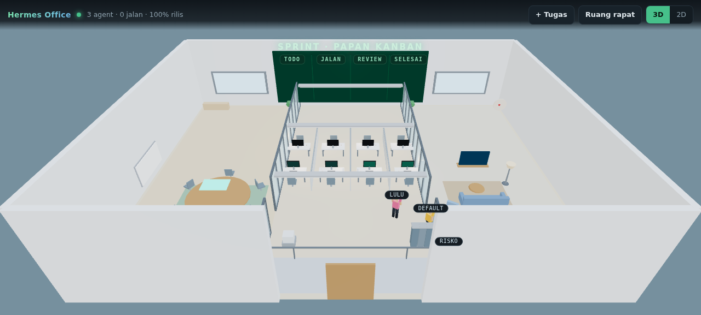
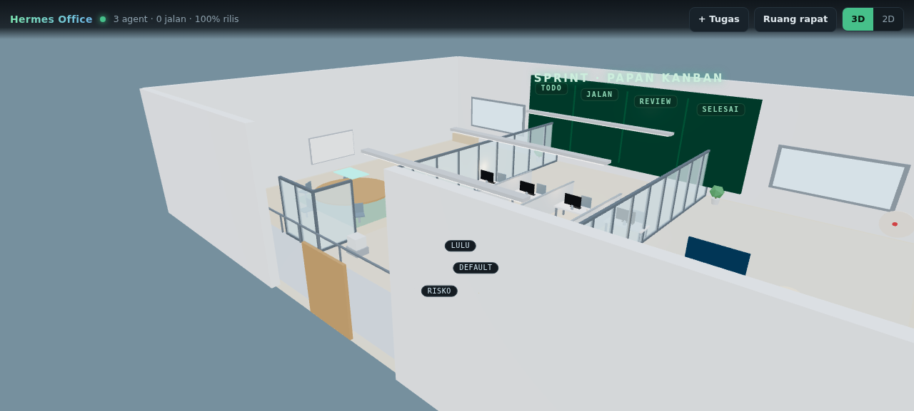
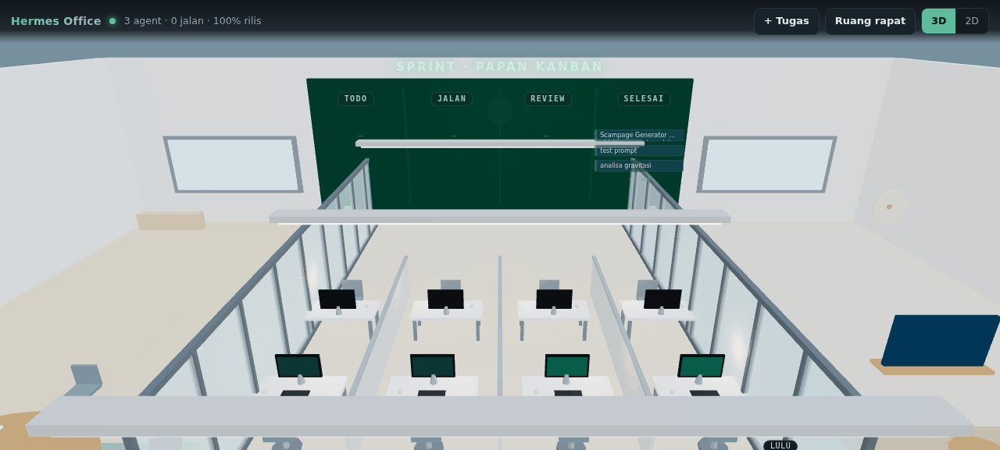

# 🏢 Hermes Virtual Office

<div align="center">

**An Open-Source 3D Virtual Workspace & Meeting Simulator for Autonomous AI Agents**

[](LICENSE)
[](https://nextjs.org/)
[](https://threejs.org/)
[](https://www.typescriptlang.org/)
[](https://github.com/NousResearch/Hermes-Agent)

[Features](#-key-features) • [Quick Start](#-quick-start) • [Architecture](#-architecture) • [Documentation](#-documentation) • [Contributing](#-contributing)

</div>

---

## 🌟 Overview

**Hermes Virtual Office** transforms your autonomous AI coding agents into an interactive, living 3D office space. Instead of staring at dry terminal logs or static dashboard rows, watch your AI fleet work in real-time:

- 💻 **Engineers sit at workstations**, typing code with real matrix-style terminal displays.
- 🗣️ **Agents hold round-table meetings**, debate technical trade-offs, and generate structured markdown minutes.
- 🔍 **QA reviewers walk across the office** to review pull requests directly at developer desks.
- ☕ **Idle agents grab coffee**, relax on lounge sofas, or play darts when waiting for new tasks.
- 📋 **Integrated Kanban Board**: 100% synchronized with Hermes tasks, supporting instant dispatch and live task inspection.

Built API-first with **Next.js**, **Three.js**, and **TypeScript**, it connects to any remote or local Hermes instance with just an API key and URL.

---

## ✨ Key Features

### 1. Interactive 3D Low-Poly Office
- **8 Dedicated Workstations**: Structured in 4 facing pairs with monitor glow, status lights, coffee mugs, and dynamic role badges.
- **Dynamic Avatar State Machine**:
  - `idle`: Lounging, resting on sofas, walking around office zones.
  - `running`: Seated, focused typing animations, active monitor screens.
  - `meeting`: Seated at conference table with hand gestures and live speech bubbles.
  - `review`: Walking over to developer workstations to inspect commits.
  - `blocked`: Pacing with an alert indicator, signaling human help is needed.

### 2. Multi-Agent AI Meeting Room
- Trigger collaborative technical discussions between 2 to 4 agents on any topic.
- **Speech Bubbles & Gestures**: CSS2D floating speech bubbles synchronized with audio/text turns.
- **Auto-Generated Meeting Minutes**: Synthesizes discussions into clear markdown containing **Decisions**, **Action Items**, and **Identified Risks**.

### 3. Live Screen Peeking & Interventions
- Click on any active agent's monitor to open a **Live Terminal Modal**, viewing real-time commands, tool calls, and progress.
- Send course corrections or cancel stalled loops directly from the office interface.

### 4. Dual View Modes
- **3D Isometric Mode**: Full 3D camera controls, orbit, zoom, ambient day/night lighting.
- **2D Kanban Mode**: High-efficiency, accessible, mobile-friendly Kanban board for rapid management.

### 5. API-First & Zero Lock-in
- Connects via standard HTTP/SSE to Hermes Agent (`HERMES_API_URL` & `HERMES_API_KEY`).
- Includes a built-in **Mock Development Mode** allowing developers to preview and contribute without hosting a live Hermes server.

---

## 🚀 Quick Start

### Prerequisites
- Node.js 18.17+ or 20+
- npm, pnpm, or bun

### 1. Clone the repository
```bash
git clone https://github.com/your-username/hermes-virtual-office.git
cd hermes-virtual-office
```

### 2. Configure Environment
```bash
cp .env.example .env.local
```

Edit `.env.local` to configure your Hermes instance:
```env
# Connection mode: 'api' (standard) or 'mock' (for preview)
HERMES_DRIVER=api
HERMES_API_URL=http://localhost:8642
HERMES_API_KEY=your_hermes_api_key_here

# LLM Provider for Meeting & Chat features
AI_BASE_URL=https://api.openai.com/v1
AI_API_KEY=your_llm_key
AI_MODEL=gpt-4o-mini
```

### 3. Install & Run
```bash
npm install
npm run dev
```

Open [http://localhost:3000](http://localhost:3000) in your browser.

---

## 🐳 Docker Deployment

Run with Docker Compose in a single command:

```bash
docker compose up -d
```

See [docs/DEPLOYMENT.md](docs/DEPLOYMENT.md) for production guidelines with Nginx/Traefik and SSL.

---

## 📐 Architecture

Hermes Virtual Office is designed with clean boundary layers:

```
┌────────────────────────────────────────────────────────┐
│                   Browser Client                       │
│    Next.js UI + Three.js 3D Isometric View + HUD      │
└──────────────────────────┬─────────────────────────────┘
                           │ HTTP / SSE
┌──────────────────────────▼─────────────────────────────┐
│                 Next.js App Server                     │
│  ├── /api/hermes/sync       (SSE Realtime Poller)      │
│  ├── /api/hermes/tasks      (Kanban Task CRUD)         │
│  ├── /api/hermes/chat       (Direct & Group Chat)      │
│  └── /api/hermes/meeting    (Meeting Room Orchestrator)│
└──────────────────────────┬─────────────────────────────┘
                           │
             ┌─────────────┴─────────────┐
             ▼                           ▼
[Driver: Hermes API Server]     [Driver: Mock Preview]
  • OpenAI-Compatible :8642       • Offline Demo
  • Remote / Local                • UI Testing
```

Detailed architectural specifications are documented in [docs/ARCHITECTURE.md](docs/ARCHITECTURE.md).

---

## 📸 Preview



The floor is laid out as a real office: an enclosed glass meeting room (west), an
open-plan workstation bay under ceiling strips (centre), a lounge with sofa, TV
and pantry (east), and a corridor along the entrance that links them.





---

## ⚠️ Prerequisites you should know

- **Kanban is not exposed on the Hermes API server (`:8642`).** The board lives in
  the dashboard plugin on `:9119`, gated by dashboard-cookie auth. This app
  therefore drives the official `hermes kanban ... --json` CLI, which means **it
  must run on the same host as Hermes.** See
  [docs/IMPLEMENTATION-NOTES.md](docs/IMPLEMENTATION-NOTES.md) for the route-table
  evidence and the one-file seam (`src/lib/hermes/kanban.ts`) where an HTTP driver
  would slot in.
- The CLI refuses to run inside a delegated agent context; the bridge strips those
  environment markers for you.
- Some OpenAI-compatible gateways reply with SSE frames even when `stream` is not
  requested. The client tolerates plain JSON, SSE, and a glued `data: [DONE]` tail.

---

## 📚 Documentation

- [Implementation Notes](docs/IMPLEMENTATION-NOTES.md) — real findings, gotchas, and the verification log.
- [System Architecture](docs/ARCHITECTURE.md) — Detailed diagrams, 3D coordinate system, and component hierarchies.
- [API Specification](docs/API-SPEC.md) — Comprehensive REST endpoints, payloads, and SSE event contracts.
- [Meeting Protocol](docs/MEETING-PROTOCOL.md) — Turn management, prompt guardrails, and auto-notulen engine.
- [Production Deployment](docs/DEPLOYMENT.md) — Docker, systemd, reverse proxy, and hardening guides.
- [Contributing Guidelines](CONTRIBUTING.md) — Code style, pull request workflow, and issue templates.

---

## 🤝 Contributing

Contributions are welcome! Please read [CONTRIBUTING.md](CONTRIBUTING.md) before submitting pull requests.

1. Fork the Project
2. Create your Feature Branch (`git checkout -b feature/AmazingFeature`)
3. Commit your Changes (`git commit -m 'feat: Add some AmazingFeature'`)
4. Push to the Branch (`git push origin feature/AmazingFeature`)
5. Open a Pull Request

---

## 📄 License

Distributed under the **MIT License**. See [LICENSE](LICENSE) for more information.

---

<div align="center">
Built with ❤️ for the <b>Hermes Agent</b> autonomous AI community.
</div>
